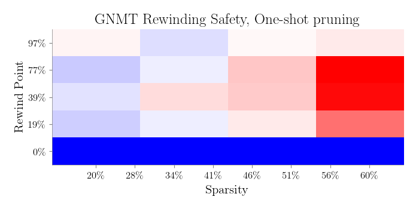
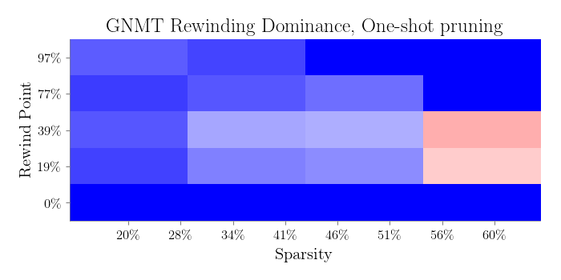
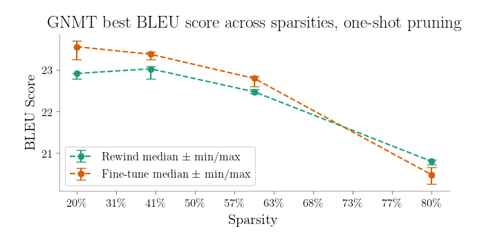
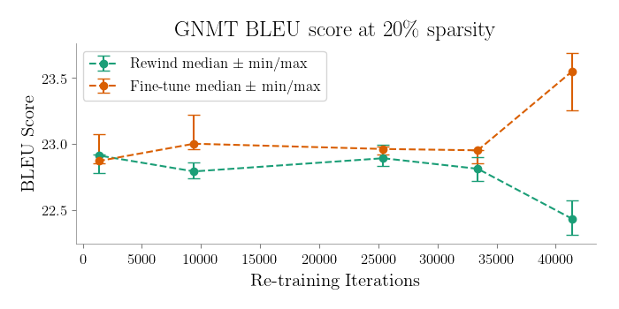
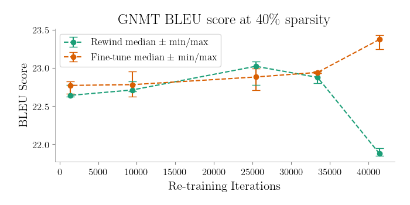
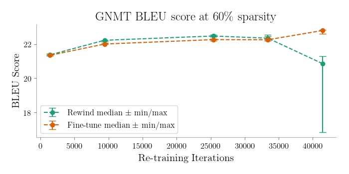
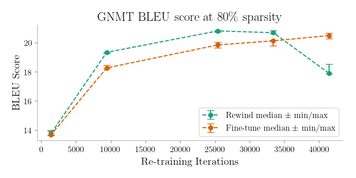

# LSTM

We compared fine-tuning and rewinding on the GNMT model (https://arxiv.org/abs/1609.08144) in the MLPerf benchmark (https://mlperf.org/training-overview), which is a seq-to-seq model based on stacked LSTMs, trained on the WMT English-German dataset.
We used NVIDIA's implementation at https://github.com/NVIDIA/DeepLearningExamples/tree/4e00153/TensorFlow/Translation/GNMT.
Due to hardware and time constraints, we use hidden layer sizes of 512 units rather than 1024 units.
We prune all weights using global magnitude pruning.
We compare across a small set of sparsities and re-training budgets.

Preliminary results are consistent with the results for vision networks, showing that at high sparsities (80%), rewinding outperforms fine-tuning on this LSTM-based network.
At lower sparsities, fine-tuning outpeforms rewinding, and at medium sparsities, the two techniques behave approximately equivalently.
These results match those seen for vision networks.

## Results

### Safety and Dominance

### Maximum Accuracy

### Equal Budget

